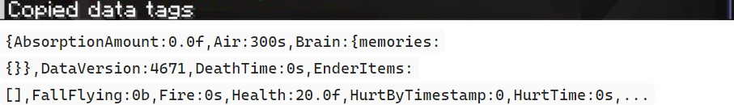
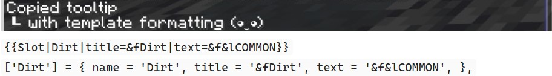
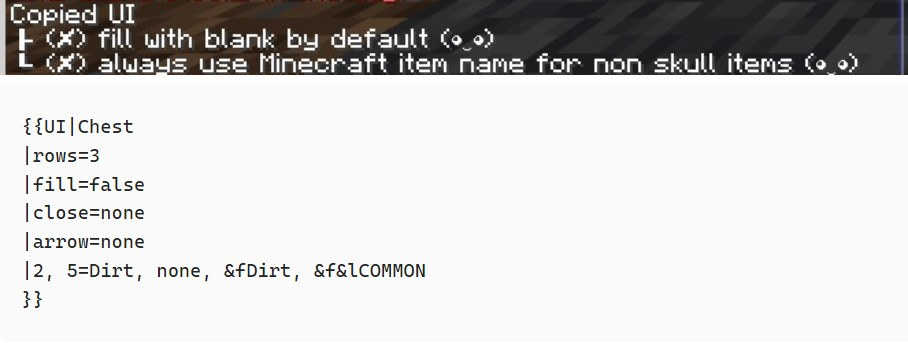
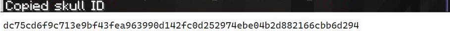
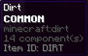

# WikiTools

WikiTools is a Minecraft mod that performs tasks to support the workflow of wikis of Minecraft servers.

This mod focuses on non-rendering tasks. There is a separate mod, [WikiRenderer](https://github.com/skyblock-wiki/WikiRenderer), for rendering tasks.

## Installation

- Install the correct Minecraft version required by WikiTools (find Minecraft version requirement in [Releases])
- Install [Fabric](https://fabricmc.net/)
- Install mods for Fabric:
  - WikiTools (see [Releases])
  - [Fabric API](https://modrinth.com/mod/fabric-api/versions) for the correct Minecraft version

## Features

#### Copy Data Tags

Copy data tags (NBT) to your clipboard.

**Key**: N

This feature works on:
- Entities you are looking at; The texture ID of the player skin is included (if applicable).
- Items you are hovering over.

#### Copy Item Tooltip

Copy tooltip data of the item you are hovering over to your clipboard.

**Key**: X

Available Behaviors:
- Default: Copy tooltip data in the format of an inventory slot template call.
- Shift+Key: Copy tooltip data in the format of a tooltip module data item.

#### Copy Opened UI

Copy the opened UI to your clipboard in the UI template format.

**Key**: C

Available Behaviors:
- Default: The empty slot is the implicit slot and thus will not be added explicitly. The displayed name on an item is used as item name in the UI template item definition.
- Shift+Key: Fill with blank by default mode: Change the implicit slot to Black Stained Glass Pane (Blank), so it will not be added explicitly. The empty slot will be added explicitly.
- Control+Key: Always use Minecraft item name for non skull items mode:
  - For player heads, since the item name "Player Head" is often not useful, the displayed name is used as item name in the UI template item definition.
  - For all other items, the English Minecraft item name is used as item name in the UI template item definition. If an item is enchanted, the item name becomes `Enchanted <Minecraft item name>`.

#### Copy Skull ID

Copy the texture ID of a skull to your clipboard. With this ID, the corresponding skin file can be downloaded on `https://textures.minecraft.net/texture/<ID>`.

This feature works on:
- Placed player heads.
- Entities wearing player heads (excluding Players and NPCs).
- Player head items you are hovering over.

**Key**: Z

#### Mod Update Checker

Check for new WikiTools release on GitHub and send an update reminder message.

#### View Item ID

Find the SkyBlock item ID of the item you are hovering over and append it to the tooltip shown on screen.

This feature is active when Show Advanced Tooltips (F3+H) is on.

## License

WikiTools is licensed under [LGPL-3.0-or-later](./LICENSE).

## Other Pages

- [Attribution](./ATTRIBUTION.md)
- [Changelog](./CHANGELOG.md)
- [Contributing](./CONTRIBUTING.md)

[Releases]: https://github.com/skyblock-wiki/wikitools/releases
